# 
   Escuela Politécnica Nacional
# 
 Manual de Usuario Pagina Web: "Tacos el Tommy"

## 
 PROYECTO FINAL DE WEB
## 
 “TACOS EL TOMMY”
## 
 INTEGRANTES
## 
 JHONATTAN AMAGUA
## 
 DANIEN BELIN
## 
 MARTIN FIERRO
## 
 JESUS GONZALEZ
## 
 FECHA DE ENTREGA 09/04/2023
### 1.	INDICE
    2.	Introducción	3
    3.	Marco teórico:	3
    4.	Manual de Usuario	3
    4.1 Página de Inicio	3
    4.2 Registro	5
    4.3 Inicio de sesión	6
    4.4 Vista de Administrador	6
    4.5 Comprar	7
    4.6 Gestionar Producto	8
    4.7 Crear Producto	9
    4.8 Ver producto por ID	9
    4.9 Mostrar lista	10
    4.10 Actualizar Producto	11
    4.11 Eliminar Producto	11
    5.	Conclusiones	12
    6.	Referencias	12

2.	### Introducción
    Tacos el tommy es una pagina web con el fin de satisfacer la necesidad de ingresar al mundo digital a la taquería Tacos el Tommy, para esto fue necesario la implementación de herramientas como Firebase, NodeJs, Javascript, CSS, HTML, de manera que pueda ser una pagina funcional e interactiva para los usuarios.

3.	### Marco teórico:

    •	Node JS: Node.js fue diseñado como un entorno asincrónico para la ejecución de JavaScript basada en eventos
    •	Firebase: Una plataforma basada en la nube para crear aplicaciones web y móviles 
    •	Javascript: JavaScript es un lenguaje de programación o lenguaje de secuencias de comandos que permite la integración de funciones sofisticadas en páginas web.
    •	CSS: Puede diseñar páginas web atractivas utilizando hojas de estilo en cascada (CSS).
    •	HTML:  Es un lenguaje de marcado que establece la estructura organizativa de su contenido. HTML se compone de una serie de elementos que puede utilizar para encerrar varios contenidos y modificar su apariencia o funcionamiento.

4.	### Manual de Usuario
    #### 4.1 Página de Inicio
    
    En la página inicial se emplea un botón al cual es necesario dar click en iniciar, para proceder a pasar a la pagina de login de usuario.

    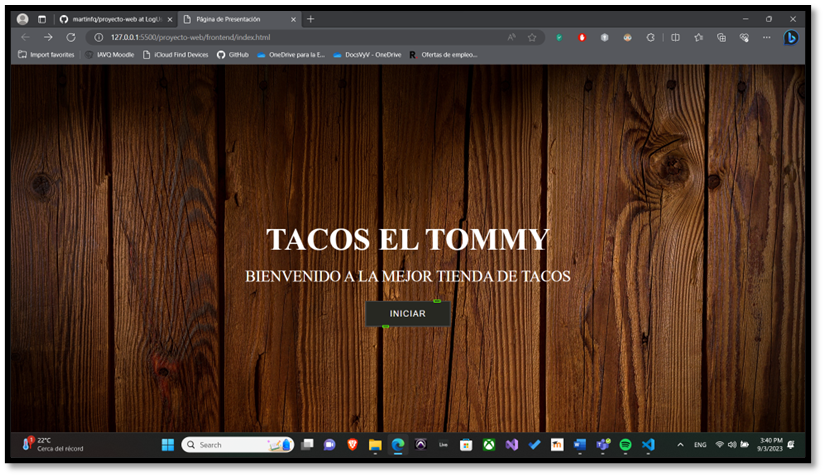 
         
    Posteriormente es necesario Registrarse para esto en la página de login se debe dar click en la esquina superior derecha donde se muestra la palabra registrarse
    #### 4.2 Registro
    
    Para registrarse es necesario escribir un correo y una contraseña no tan débil puesto que con una contraseña débil no nos permitirá el registro.

    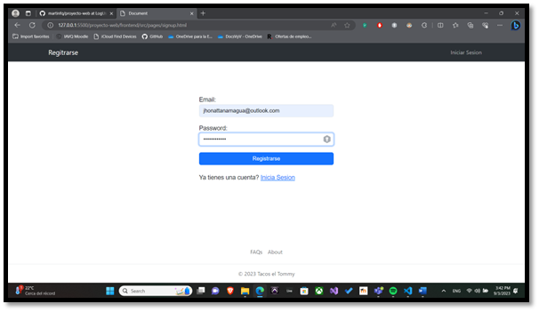
    #### 4.3 Inicio de sesión
    
    Se obtienen dos vistas, dependiendo el tipo de cuenta asociada al correo registrado y los permisos de esta.

    
    #### 4.4 Comprar
    
    Para comprar se visualizaran los elementos listados con nombre del producto y precio asociado a este, al dar click en agregar al carrito, se añadirán a los elementos dispuestos a la compra.

    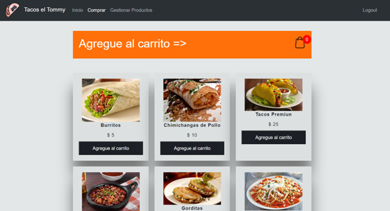
    
    Adicionalmente, se puede apreciar el historial del pedido haciendo click a la funda de compras en la parte superior derecha del título color naranja.

    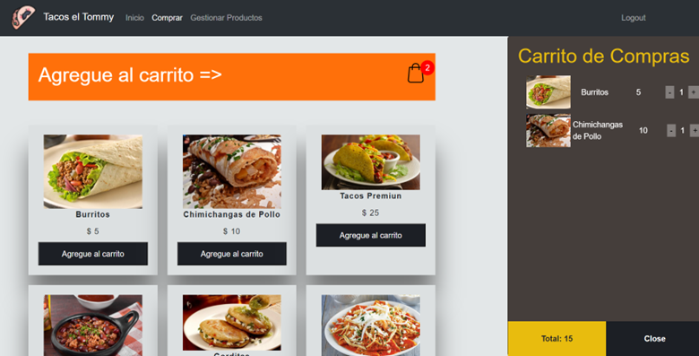
    #### 4.5 Vista de Administrador
    
    En la vista de administrador es posible apreciar una barra de navegación donde se puede encontrar Inicio, Comprar y Gestionar productos, esta ultima no existe para una cuenta sin permisos, la cuenta empleada como administrador es: daniel@hotmail.com, con clave : Papa13!.

    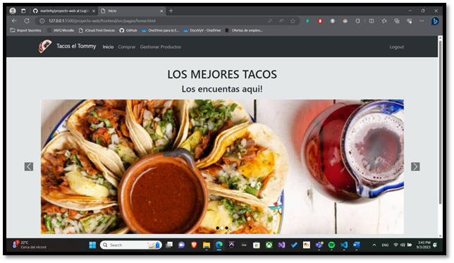
    #### 4.6 Gestionar Producto
    
    En el apartado de gestionar Productos se obtiene una lista de opciones como la visualización de todos los productos, Ver productos por UIDD, Crear Producto, Actualizar producto, y borrar productos.

    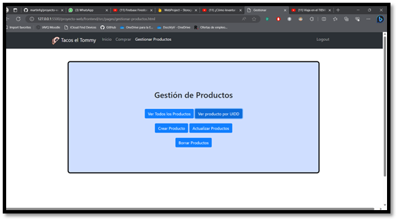
    #### 4.7 Crear Producto
    
    En el apartado de crear producto se indican campos para rellenar como nombre, precio, y un apartado de agregar imagen para el producto una vez rellenados los campos se creara el producto al dar click en el botón crear y se agregara una notificación que indica que el producto ha sido creado.

    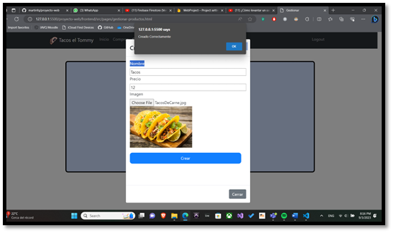
    #### 4.8 Ver producto por ID
    
    Para mostrar el producto por ID es necesario ingresar el id del producto a buscar para posteriormente mostrar la lista.

    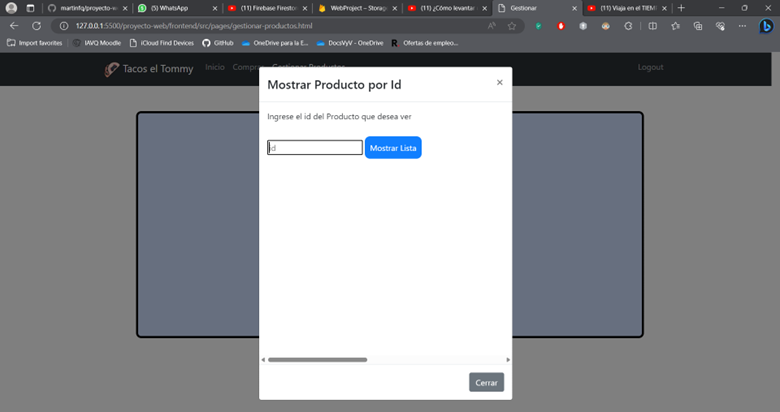
    #### 4.9 Mostrar lista
    
    Para mostrar lista simplemente se tiene que dar click en mostrar lista.

    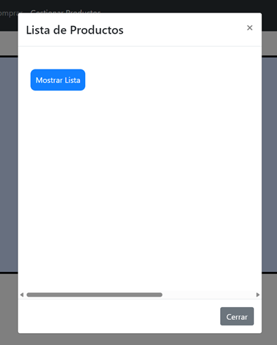
    #### 4.10 Actualizar Producto
    
    Para actualizar el producto es necesario ingresar el id del producto, allí se puede editar nombre, precio o la imagen asociada.

    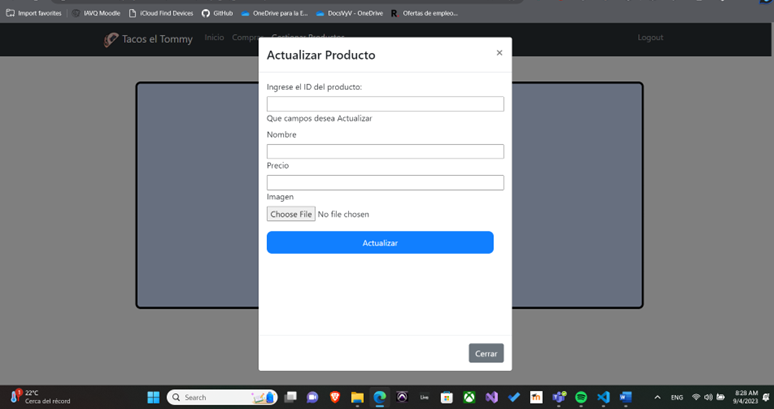
    #### 4.11 Eliminar Producto
    
    Para eliminar el producto es necesario únicamente ingresar el id del producto a eliminar.

    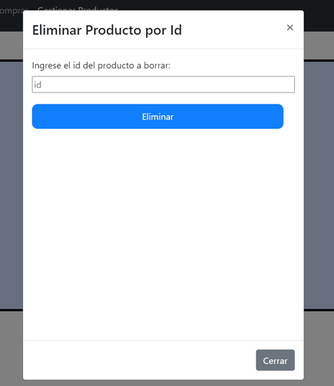
### 5.	Conclusiones 
    
Tacos el Tommy es una página web que permite gestionar productos de una taquería con operaciones CRUD, en las que se puede agregar productos eliminar listarlos, agregar en un carrito de compras y está separado por permisos de administrador como de cliente. 

Tacos el Tommy permitirá digitalizar la taquería para poder realizar ventas por medio de pedidos a través del internet.
### 6.	Referencias
    “Conceptos básicos de HTML - Aprende desarrollo web | MDN”. MDN Web Docs. Accedido el 4 de septiembre de 2023. [En línea]. Disponible: https://developer.mozilla.org/es/docs/Learn/Getting_started_with_the_web/HTML_basics
    “Qué es JavaScript? - Aprende desarrollo web | MDN”. MDN Web Docs. Accedido el 4 de septiembre de 2023. [En línea]. Disponible: https://developer.mozilla.org/es/docs/Learn/JavaScript/First_steps/What_is_JavaScript 
    “Qué es Firebase: funcionalidades, ventajas y conclusiones”. DIGITAL55. Accedido el 4 de septiembre de 2023. [En línea]. Disponible: https://digital55.com/blog/que-es-firebase-funcionalidades-ventajas-conclusiones/

    
